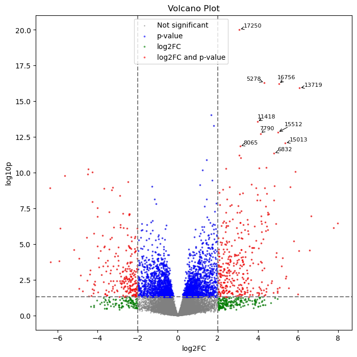

# volcanoPlot

<!-- WARNING: THIS FILE WAS AUTOGENERATED! DO NOT EDIT! -->

package website url: https://avivleemann.github.io/volcanoPlot/

## Install

``` sh
pip install volcanoPlot
```

## How to use

``` markdown
Description:
RSV or RS virus, short for respiratory syncytial virus, is a single-stranded RNA virus belonging to the pneumovirus genus of the virus family.
Symptoms are usually mild, similar to a cold, but can cause very serious illness in infants.

Dataset:
We prepared a total of 8 RNA-Seq data from acute and chronic phases in nasal samples of 4 infants
The dataset was taken from Kaggle using the following API command:
kaggle datasets download -d yoshifumimiya/rsv-rnaseq-count
```

``` python
import pandas as pd
from pathlib import Path
df = pd.read_csv(Path.cwd() / 'res_example.csv')
df.head()
```

<div>
<style scoped>
    .dataframe tbody tr th:only-of-type {
        vertical-align: middle;
    }
&#10;    .dataframe tbody tr th {
        vertical-align: top;
    }
&#10;    .dataframe thead th {
        text-align: right;
    }
</style>

|     | gene_id   | baseMean    | log2FC    | lfcSE    | stat      | p_value  | p_adj    | log10p   | sig   | regulated        |
|-----|-----------|-------------|-----------|----------|-----------|----------|----------|----------|-------|------------------|
| 0   | WASH7P    | 4.587857    | 2.458706  | 1.116766 | 2.201630  | 0.027691 | 0.202064 | 1.557654 | True  | lfc2 and p_value |
| 1   | LOC729737 | 122.155762  | 1.342039  | 0.716822 | 1.872207  | 0.061178 | 0.309724 | 1.213405 | False | non-sig          |
| 2   | TGIF1     | 1400.037490 | -0.099168 | 0.142399 | -0.696411 | 0.486171 | 0.796121 | 0.313211 | False | non-sig          |
| 3   | PRDX6     | 4794.111981 | -0.008120 | 0.200802 | -0.040440 | 0.967742 | 0.991057 | 0.014240 | False | non-sig          |
| 4   | CIC       | 1581.916300 | 0.053769  | 0.177791 | 0.302430  | 0.762324 | 0.925608 | 0.117860 | False | non-sig          |

</div>

``` python
from volcanoPlot import volcano
volcano.plot(df=df,x='log2FC', y ='log10p')
```


